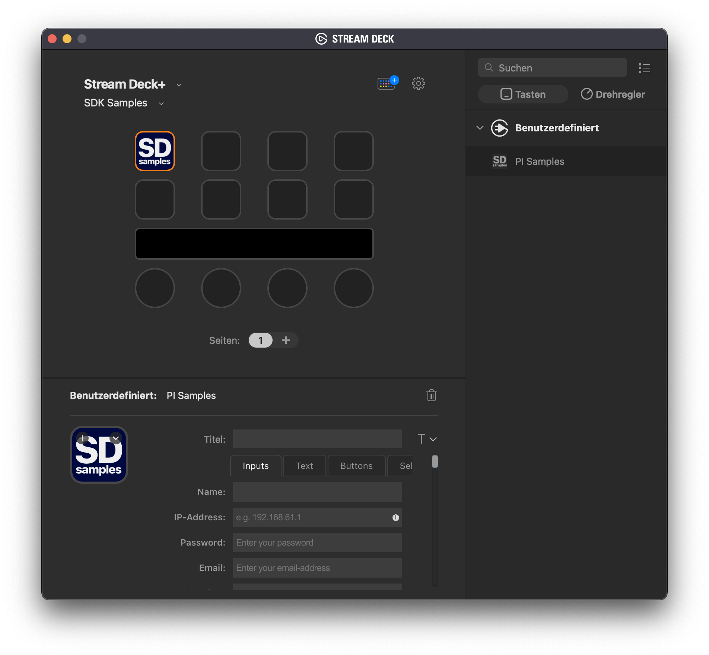

`PISamples` is a sample plugin demonstrating the [Stream Deck SDK](https://developer.elgato.com/documentation/stream-deck/).

# Description

`PISamples` is a plugin that shows all supported HTML elements in the Property Inspector.

# Features

- code written in Javascript
- cross-platform (macOS, Windows)
- Property Inspector contains all supported HTML-elements ready for copy/paste.
- index_pi.js includes some simple scripts to add interactivity to the PI, and shows how you could pass data to the plugin.

# Changes
## 2.0.3
* line-heights are now set to `normal` (from 26px) and alignment of `sdpi-label/sdpi-value` is now done by using `first baseline`.
* slight adjustment for `sdpi-label/sdpi-value` in `colors` and `textarea` elements.
* details-markers are now showing properly again.
* adjusted the carousel-cards to fit the PI's background color.
* 
## 2.0.2
* groupings for range-sliders with datalist improved (thanks to @trevligaspel)
* slight adjustment to the right scrollbar-thumb (was cut off by 1px in 6.1)
* fixed scrolling `list` containers starting at a wrong offset (thx @Toby)
* improved alignment on `details` tag. It now aligns based on the first line's baseline.
* tbd: documentation of the changes
* 
## 2.0.1
- added some CSS to improve datalist-support on ranges
- data-list options on range-sliders are now clickable
- improved support for colored and grayscale ranges
- added support for ControlCenter-style colored and grayscale sliders
- added datalist support for text inputs
- re-introduced support for input types: date, month, week, time and date-time
- added datalist support for date inputs
- added better alignment of details-labels
- minor cleanup & fixes
- 
## 2.0.0 
- added the latest libraries and introduces `SVG`images and `TABS`

# Drag and drop
- allows easy drag and drop of it's elements to your HTML-editor; just drag the item to your Property Inspector's .html file.
  
https://user-images.githubusercontent.com/80752/153376059-8897cc53-67a5-4cd0-8e47-3f966c9d9c68.mp4

# Installation

In the Release folder, you can find the file `com.elgato.pisamples.streamDeckPlugin`. If you double-click this file on your machine, Stream Deck will install the plugin.

##  Source code

The Sources folder contains the source code of the plugin.
